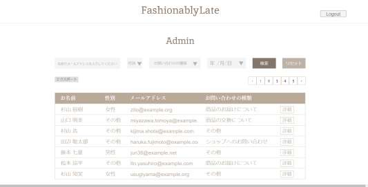

# お問い合わせフォーム

## １　環境構築
・　Dockerビルド
  （１）git clone git@github.com:hirobot3103/contact-form-fashionablylate.git
  （２）docker compose up -d --build
   ＊　開発環境に合わせて .envファイル等を編集してください。

・　Laravel環境構築
　（１）docker compose exec php bash
  （２）composer install
  （３）.env.exampleファイルから.envを作成し、環境変数を変更
  （４）php artisan key:generate
  （５）php artisan migrate
  （６）php artisan db:seed （Usersテーブルにデータを作成していません。）

## ２　使用技術
　・PHP8.3
  ・Laravel 10
  ・MySQL 8.0.26

## ３　URL
　　Github git@github.com:hirobot3103/contact-form-fashionablylate.git
    開発環境　http://locaohost:80/ , http://locaohost:8080

## ４　ER図
